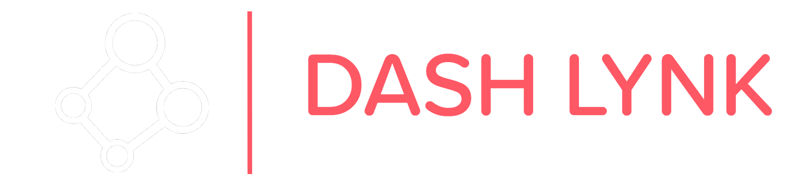
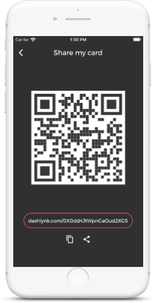
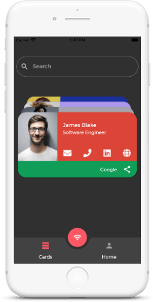

<!DOCTYPE html>
<html lang="en">

<head>
    <!-- Metas -->
    <meta charset="UTF-8">
    <meta http-equiv="X-UA-Compatible" content="IE=edge">
    <meta name="viewport" content="width=device-width, initial-scale=1.0">
    <title>Dash Lynk - One link. That’s what I want.</title>
    <meta name="description" content="Dash Lynk - One link. That’s what I want.">

    <!-- External CSS -->
    <link rel="stylesheet" href="assets/css/bootstrap.min.css">
    <link rel="stylesheet" href="assets/css/font-awesome.min.css">
    <link rel="stylesheet" href="assets/css/et-line.css">
    <link rel="stylesheet" href="assets/css/magnific-popup.css">
    <link rel="stylesheet" href="assets/css/animate.css">
    <link rel="stylesheet" href="assets/css/owl.carousel.css">
    <link rel="stylesheet" href="assets/css/owl.transitions.css">
    <link rel="stylesheet" href="assets/css/plyr.css">

    <!-- Custom CSS -->
    <link rel="stylesheet" href="css/style.css">
    <link rel="stylesheet" href="css/responsive.css">

    <!-- Google font -->
    <link href="https://fonts.googleapis.com/css?family=Poppins:300,400%7CUbuntu:400,700%7COpen+Sans" rel="stylesheet">

    <!-- Favicon -->
    <link rel="icon" href="images/favicon.png">
    <link rel="apple-touch-icon" href="images/apple-touch-icon.png">
    <link rel="apple-touch-icon" sizes="72x72" href="images/icon-72x72.png">
    <link rel="apple-touch-icon" sizes="114x114" href="images/icon-114x114.png">

    <!--[if lt IE 9]>
      
      
    <![endif]-->
</head>

<body>

    <!-- Preloader -->
    

        

    

    <!-- Preloader End -->

    <!-- Navigation -->
    <nav class="navbar navbar-default" data-spy="affix" data-offset-top="60">
        

            <!-- Brand and toggle get grouped for better mobile display -->
            

                <button type="button" class="navbar-toggle collapsed" data-toggle="collapse" data-target="#navbar-collapse" aria-expanded="false">
                    Toggle navigation
                    
                    
                    
                </button>
                
            

            <!-- Collect the nav links, forms, and other content for toggling -->
            

                <ul class="nav navbar-nav navbar-right" id="one-page-nav">
                    <li><a href="#banner">Home</a></li>
                    <li><a href="#feature">Features</a></li>
                    <li><a href="#description">Sharing</a></li>
                    <!--<li><a href="#screenshot">Screenshot</a></li>-->
                    <!--<li><a href="#pricing">Pricing</a></li>-->
                    <li><a href="#support">Supports</a></li>
                    <li><a href="#download">Download</a></li>
                    <!--<li><a href="#contact">Contact</a></li>-->
                </ul>
            

            <!-- /.navbar-collapse -->
        

        <!-- /.container-fluid -->
    </nav>
    <!-- Navigation End -->

    <!-- Banner Area -->
    

        

            

                

                    

                        

                            

                                <h1 class="banner-title">One link.  That’s what I want.</h1>
                                
Share business cards in a simple, secure and easy way, with just one link.

                                
Available in App Store &amp; Google Play

                                

                                    <a class="btn btn-lg btn-download" href="#"><i class="fa fa-apple"></i> App Store</a>
                                    <a class="btn btn-lg btn-download btn-border" href="#"><i class="fa fa-android"></i> Play Store</a>
                                

                            

                        

                        

                            

                                
                                
                            

                        

                    

                

            

        

    

    <!-- Banner Area End -->
        <footer>
        <!-- Footer logo and social media button -->
        

            

                <!---->
                

                    <a href="https://www.facebook.com/dashlynk"><i class="fa fa-facebook"></i></a>
                    <a href="https://twitter.com/dashlynk1"><i class="fa fa-twitter"></i></a>
                    <a href="https://instagram.com/dash.lynk"><i class="fa fa-instagram"></i></a>
                    <a href="https://www.linkedin.com/company/dashlynk/"><i class="fa fa-linkedin"></i></a>
                    <a href="mailto:dev@dashlynk.com"><i class="fa fa-envelope"></i></a>
                

            

        

        <!-- Footer logo and social media button -->

        <!-- Footer copyrgiht and navigation -->
        

            

                

                    

                        
Copyright © 2020 Wedupp Pvt Ltd. All Right Reserved

                    

                    

                        <ul class="footer-nav">
                            <li><a href="#">Terms &amp; Conditions</a></li>
                            <li><a href="#">Legal</a></li>
                            <li><a href="#">FAQ</a></li>
                        </ul>
                    

                

            

        

        <!-- Footer copyrgiht and navigation -->
    </footer>
    <!-- Script -->
    
    
    
    
    
    
    
    
    
    
    
    
    
  </body>
</html>
